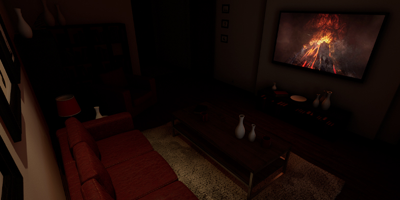

# ue4-tv-light
A dynamically lit TV screen effect using light functions. Created by Nick Mower in Unreal Engine 4.

Full tutorial can be found here: https://www.techarthub.com/creating-a-tv-lighting-effect-with-unreal-engine-4/

This project is licensed under the Unreal Engine 4 EULA.